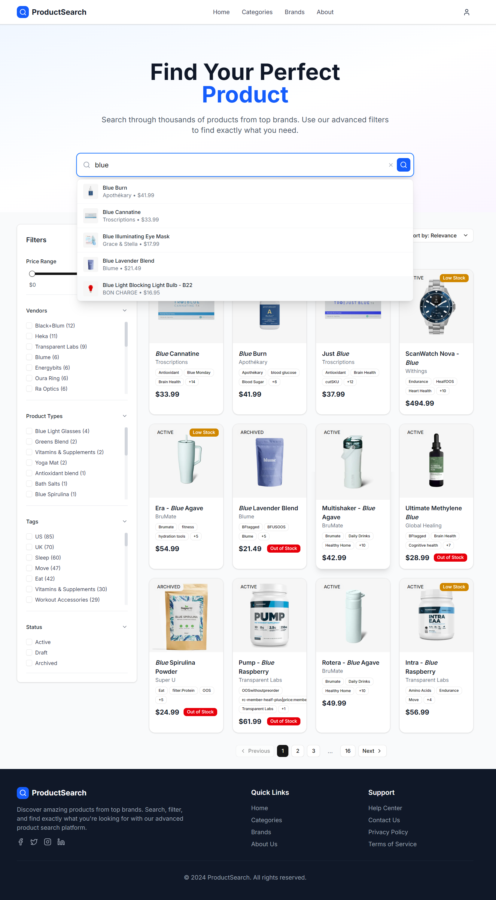

# Product Search Platform

## Overview

A modern product search platform built with Next.js that enables users to search, filter, and discover products from a CSV dataset. The application features a powerful Elasticsearch backend, intuitive filtering capabilities, and a responsive UI.

 _Example screenshot showing search interface_

## Key Features

- 🔍 Advanced search with autocomplete suggestions
- 🎚️ Comprehensive filtering (price, vendor, product types, tags, status)
- 🔄 Sorting options
- 📱 Fully responsive design
- 📊 Product detail pages
- 🚀 Optimized performance with Elasticsearch

## Technical Stack

- **Frontend**: Next.js 15, React 19, TypeScript, Tailwind CSS
- **Backend**: Next.js API Routes
- **Database**: SQLite
- **Search Engine**: Elasticsearch 8.12
- **Styling**: Tailwind CSS with custom themes
- **Containerization**: Docker

## File Structure

```
product-search/
├── docker-compose.yml
├── Dockerfile
├── package.json
├── README.md
├── data/
│   ├── csv.csv                    # Raw CSV import file
│   └── products.db                # SQLite datastore
├── src/
│   ├── app/
│   │   ├── api/
│   │   │   ├── autocomplete/
│   │   │   │   └── route.ts       # Autocomplete API endpoint
│   │   │   ├── index-data/
│   │   │   │   └── route.ts       # Bulk‐indexing endpoint
│   │   │   └── search/
│   │   │       └── route.ts       # Search API endpoint
│   │   ├── product/
│   │   │   └── [handle]/
│   │   │       └── page.tsx       # Product detail page
│   │   ├── layout.tsx             # Main app layout
│   │   ├── page.tsx               # Home/search landing page
│   │   └── globals.css            # Global styles
│   ├── components/
│   │   ├── filters/
│   │   │   ├── FilterOption.tsx
│   │   │   ├── FilterSection.tsx
│   │   │   ├── FilterSidebar.tsx
│   │   │   └── PriceFilter.tsx
│   │   ├── layout/
│   │   │   ├── Header.tsx
│   │   │   └── Footer.tsx
│   │   ├── product/
│   │   │   ├── ProductDetails.tsx
│   │   │   ├── ProductImageGallery.tsx
│   │   │   └── ProductInformation.tsx
│   │   ├── search/
│   │   │   ├── HeroSection.tsx
│   │   │   ├── Pagination.tsx
│   │   │   ├── ProductCard.tsx
│   │   │   ├── ProductGrid.tsx
│   │   │   ├── SearchBar.tsx
│   │   │   └── SortDropdown.tsx
│   │   └── ui/
│   │       ├── badge.tsx
│   │       ├── button.tsx
│   │       ├── checkbox.tsx
│   │       ├── dropdown-menu.tsx
│   │       ├── separator.tsx
│   │       └── slider.tsx
│   ├── lib/
│   │   ├── db.ts                  # SQLite helpers
│   │   ├── elastic.ts             # Elasticsearch client
│   │   ├── elasticsearch.ts       # Index‐search logic
│   │   ├── utils.ts               # Shared utilities
│   │   └── validation/
│   │       ├── autocompleteSchema.ts
│   │       └── searchQuerySchema.ts
│   ├── scripts/
│   │   └── load-data.ts           # CSV → DB → ES loader
│   └── types/
│       ├── filter.ts
│       ├── product.ts
│       └── search.ts
```

## Setup and Installation

### Local Development

1. **Install dependencies**

```bash
npm install
```

2. **Set up environment**

```bash
cp .env.example .env
# Update Elasticsearch URL if needed
```

3. **Load data**

```bash
npm run load-data
```

4. **Build the project**

```bash
npm run build
```

5. **Start project**

```bash
npm run start
```

### Docker Setup

1. **Build and start containers**

```bash
docker-compose up --build
```

2. **Access application**

```
http://localhost:3000
```

## Search Implementation Approach

### Data Pipeline

1. CSV parsing with `csv-parser`
2. SQLite storage for data persistence
3. Elasticsearch indexing with custom mappings
4. API endpoints for search operations

### Search Features

- **Full-text search**: Multi-field search with boosting
- **Fuzzy matching**: Handles typos and partial matches
- **Autocomplete**: Real-time suggestions as you type
- **Aggregations**: Dynamic filter options based on results
- **Post-filtering**: Maintains accurate facet counts

### Performance Optimizations

- Efficient Elasticsearch queries
- Debounced search requests
- Elasticsearch Indexing
- Paginated results

## Enhanced Features Implementation

### 🔄 Advanced Sorting Capabilities

- 7 different sorting options with visual indicators
- Relevance-based default sorting
- Price sorting (low-high/high-low)
- Chronological sorting (newest/oldest)
- Alphabetical sorting (A-Z/Z-A)
- Persists across pagination

### 🎚️ Comprehensive Filtering System

- Visual price range slider with debounced updates
- Vendor filtering with availability counts
- Product type categorization
- Tag-based filtering with popularity indicators
- Status-based filtering (active/draft/archived)
- Real-time filter counts with Elasticsearch aggregations

### 🔍 Intelligent Search Suggestions

- Real-time typeahead suggestions as you type
- Fuzzy matching with typo tolerance

## Technical Decisions & Trade-offs

### Elasticsearch

- **Pros**: Superior full-text search, fuzzy matching, aggregations
- **Cons**: Additional infrastructure requirement
- **Solution**: Docker Compose setup for easy Elasticsearch deployment

### Hybrid Data Loading

1. SQLite for initial data storage
2. Elasticsearch for search operations

- **Rationale**: Leverages strengths of both systems

### Trade-offs

- SQLite used only as initial data store, not for search
- Docker requirement for Elasticsearch simplifies setup but adds complexity
- Client-side rendering for search UX vs. potential SSR benefits

## Assumptions & Interpretations

### CSV Structure

Assumed columns:

- ID, TITLE, HANDLE, DESCRIPTION_HTML
- VENDOR, TAGS, FEATURED_IMAGE
- PRICE_RANGE_V2, CREATED_AT, UPDATED_AT
- PRODUCT_TYPE, STATUS, TOTAL_INVENTORY, SEO

### Product Status Handling

- Interpreted statuses: active, draft, archived
- Visual indicators for different statuses
- Inventory alerts for low stock

### Search Experience

- Fuzzy search enabled by default
- Multi-field search with field weighting

## Requirements Coverage

### Core Requirements

| Requirement          | Implementation Status      |
| -------------------- | -------------------------- |
| CSV parsing          | ✅ Complete                |
| Search functionality | ✅ Advanced implementation |
| Filtering            | ✅ Multiple dimensions     |
| Sorting              | ✅ 7 sorting options       |
| Autocomplete         | ✅ Real-time suggestions   |
| Responsive design    | ✅ Mobile-first approach   |

### Advanced Features

| Feature         | Implementation                    |
| --------------- | --------------------------------- |
| Fuzzy search    | ✅ Elasticsearch implementation   |
| Partial matches | ✅ Through Elasticsearch          |
| Empty states    | ✅ Custom empty state UI          |
| Performance     | ✅ Optimized for large datasets   |
| Error handling  | ✅ Comprehensive error boundaries |

### UI/UX Elements

| Element           | Implementation                    |
| ----------------- | --------------------------------- |
| Visual hierarchy  | ✅ Clear information architecture |
| Responsive design | ✅ Fully responsive components    |
| Detailed view     | ✅ Comprehensive product page     |
| Filter management | ✅ Collapsible sections           |

## Future Improvements

1. User authentication and saved searches
2. Advanced analytics dashboard
3. Search history and recommendations
